# ☸️ DevOps_Deploy — CD Repository

此 Repo 負責 **持續部署 (CD, Continuous Deployment)** 階段，整合 **ArgoCD、GitHub Actions、K3s、Cloudflare Tunnel 與 AWS 服務**，實現從邊緣裝置到雲端的自動化部署與監控。

---

下圖為整體應用部署架構示意：

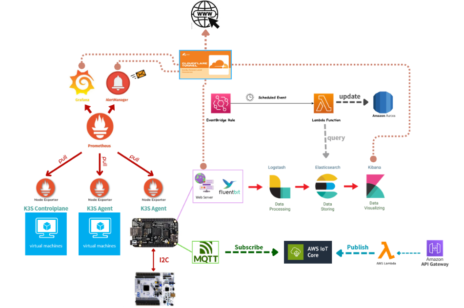
## 🔹 架構說明

### 1️⃣ Kubernetes & ArgoCD 部署層

- 以 **K3s Cluster** 作為輕量化 Kubernetes 平台：
  - ControlPlane VM 與兩台 Agent VM 構成叢集。
  - BBB (BeagleBone Black) 作為 ARM 架構 Agent Node。
  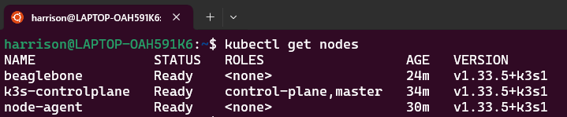

- **ArgoCD (GitOps Controller)**：
  - 從本倉庫 (`DevOps_Deploy`) 監控多個應用目錄。
  - 每當 Pull Request 合併至 `main` 分支，ArgoCD 會自動同步至 K3s 集群。
  - 採用 `sync-wave` `hook` 機制控制部署順序（如 ELK → Prometheus → IoT 應用）。

---

### 2️⃣ 監控與告警層
- **Prometheus**：集中收集節點與 Pod 的 Metrics。
- **Node Exporter**：提供各節點系統資源監控資訊。
- **AlertManager**：
  - 根據 Prometheus 規則發出 Email 告警。
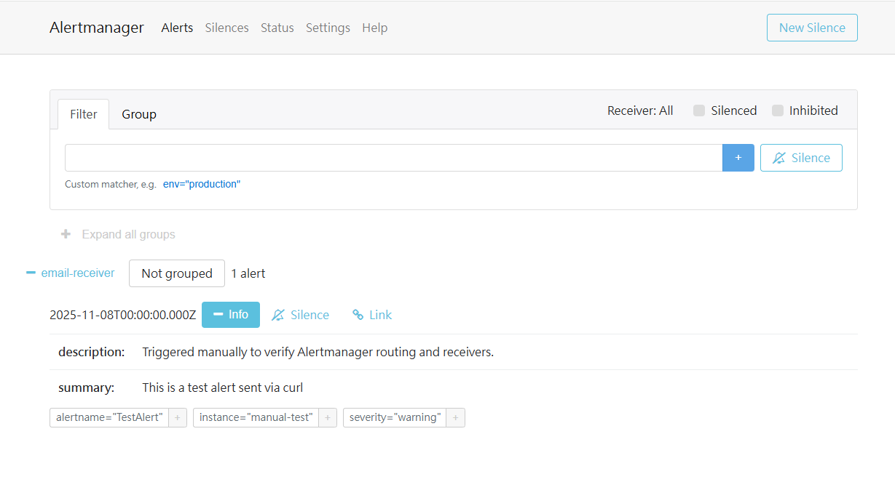

警報觸發時發送E-mail：
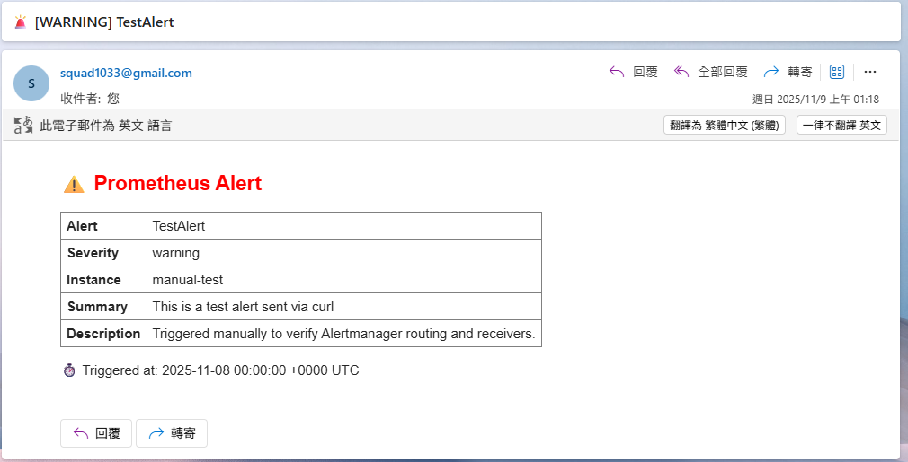

- **Grafana**：
  - 視覺化展示系統與應用層監控儀表板。
  - 整合 Cloudflare Tunnel 提供安全的外部存取。
  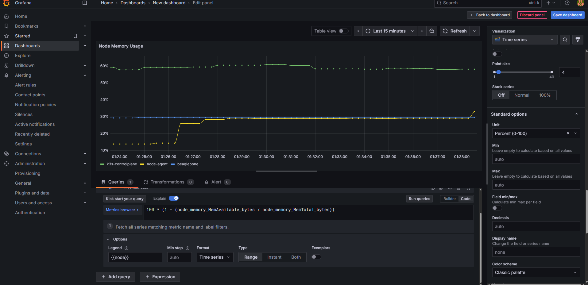

---

### 3️⃣ 日誌收集與分析層
- **Fluent Bit (sidecar)**：
  - 部署於 BBB 與 Web Server Pod，用於收集應用層日誌。
- **ELK Stack (Logstash → Elasticsearch → Kibana)**：
  - Logstash：資料清洗與結構化。
  - Elasticsearch：集中式日誌索引與儲存。
  - Kibana：圖形化日誌查詢與分析介面。
  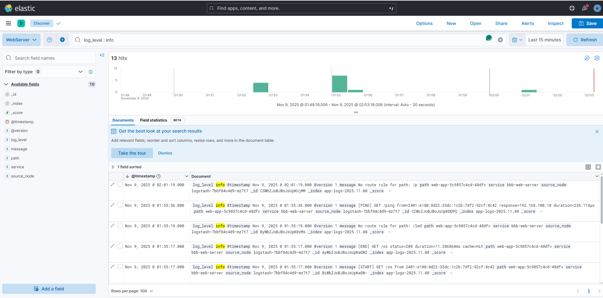

- **Cloudflare Tunnel**：。
  - 將 Web Server 暴露至外部 Internet
  - 將 Kibana 與 Grafana 暴露至外部 Internet。
  - 將 Elasticsearch (經由 Nginx 作為 HTTPS to HTTP Proxy) 暴露給 AWS Aurora。
  - 提供安全通道，避免直接暴露叢集端點。

---

### 4️⃣ IoT 與雲端整合層
- **BeagleBone Black (BBB)**：
  - 執行容器化 Web Server（內含 Fluent Bit）, 並以RESTful API實現。
  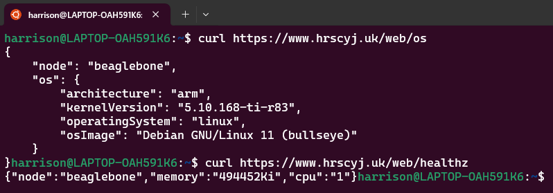

  - 透過 I²C 與 STM32 溝通控制實體設備。
  - 與 AWS IoT Core 以 MQTT 通訊：
    - **Subscribe**：接收雲端下發控制指令。
      
    從訂閱的Topic取得內容後之應用程序log :
    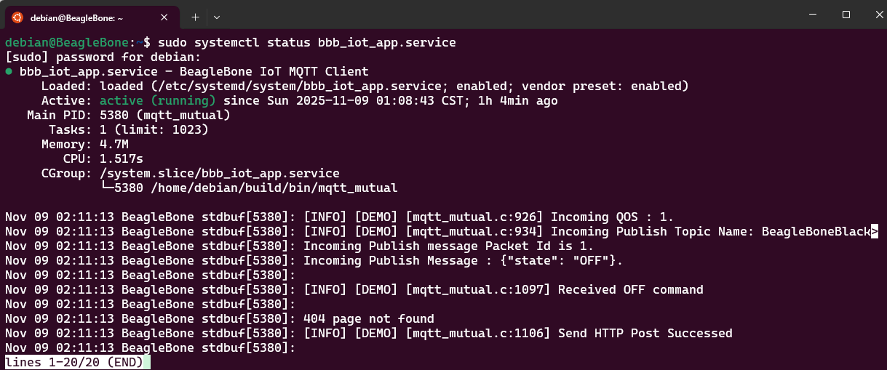

  - Redis 佈署於 controlplane 作簡易快取, 於收到 Request 時更新或返回快取資料
- **AWS Lambda & API Gateway**：
  - API Gateway 為前端指令入口。
  - Lambda 接收 API 呼叫後 Publish 至 IoT Core。
    
  透過 API Gateway發佈內容到 IoT Core 上的 Topic :
  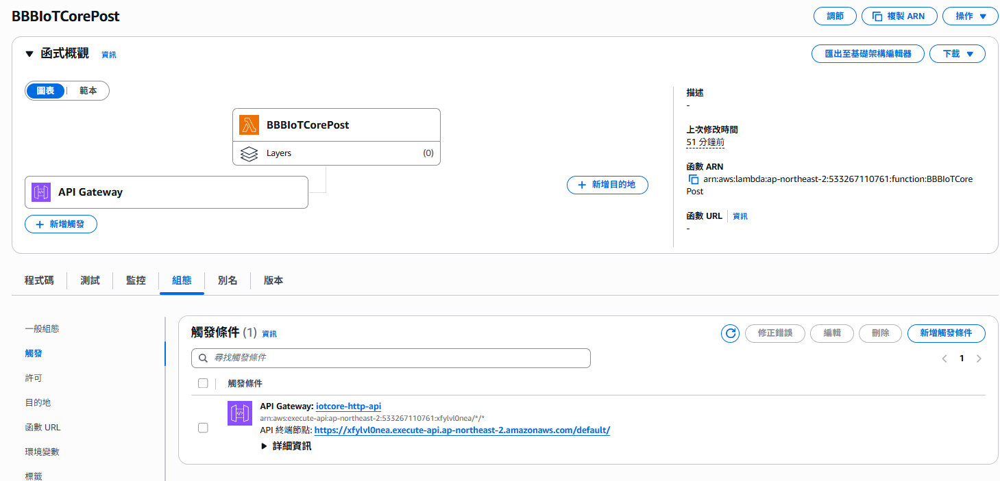
  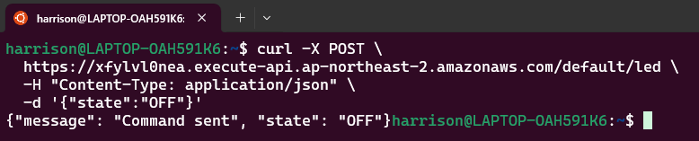

  AWS IoT Core 上 Topic 的 Queue :
  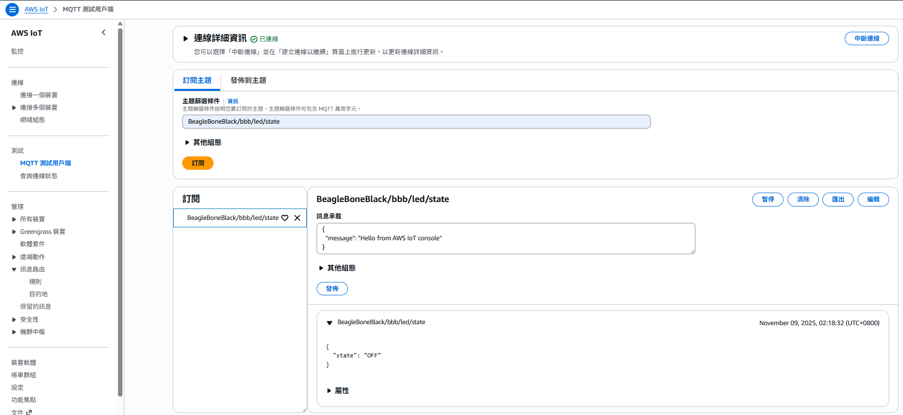

- **EventBridge + Lambda + Aurora + Elasticsearch**：
  - EventBridge 定時觸發 Lambda。
  - Lambda 週期性從 Elasticsearch Query 資料，更新至 Aurora。
  - 實現雲端資料彙整與可視化循環。
    
  Lambda 寫入 Aurora 簡介圖 :
  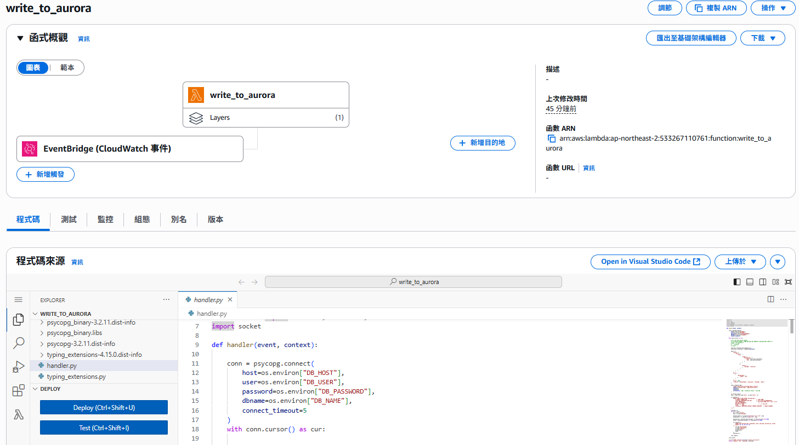
  
  CloudWatch 記錄寫入的結果 :
  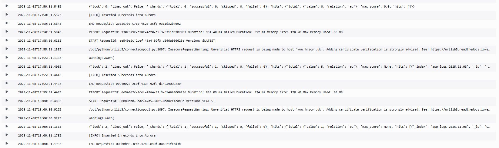

---

## ⚙️ 部署流程說明
1. **CI Repo (`DevSecOps_with_BBB`)**
   - Jenkins / GitHub Actions 負責：
     - 建構、測試與安全掃描 (SonarQube、Trivy)。
     - 生成 K8s YAML / Helm Values 並自動發 PR 至此 Repo。
   - 僅當測試通過才進入 CD 階段。

2. **CD Repo (`DevOps_Deploy`)**
   - PR 經人工審核後合併至 `main`。
   - 觸發 GitHub Actions：
     - 驗證 YAML 結構正確。
     - 通知 ArgoCD 進行同步。
  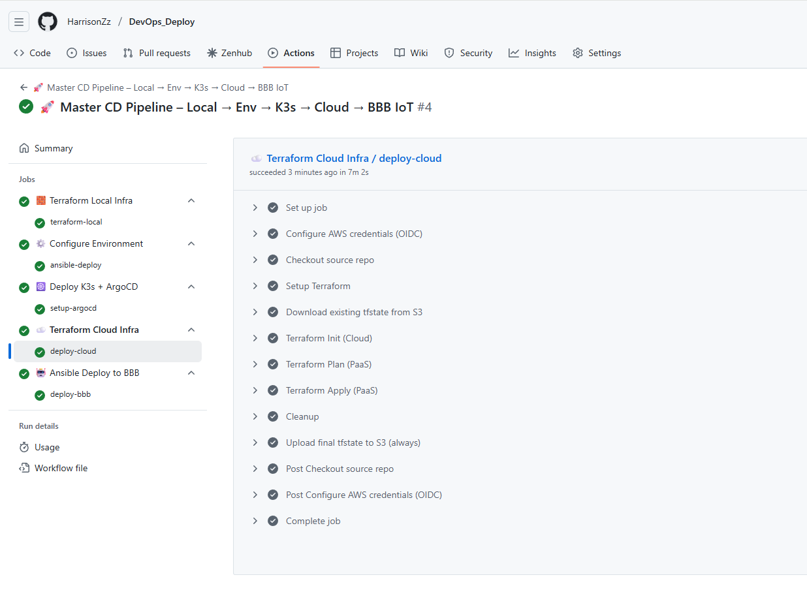

3. **ArgoCD 自動同步**
   - 偵測 `main` 更新 → 觸發 GitOps Sync。
   - 根據 `sync-wave` 部署順序：
     1. ELK Stack
     2. Prometheus / AlertManager / Grafana
     3. IoT Web Server / MQTT Client
